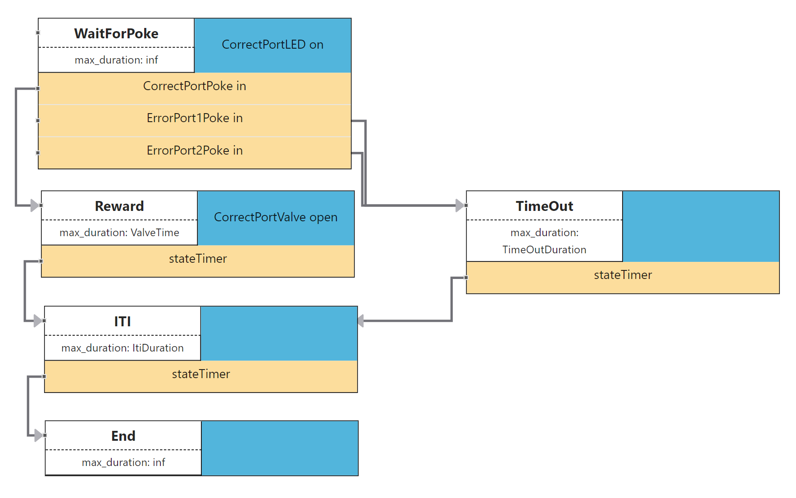

# Light Chasing Task

## Task Description
A subject is in an environment with 3 behavioral ports (left: port 1, center: port 2, right: port 3), each consisting of an infrared-based photogate for poke detection, a white LED, and a water reward system based on a valve that can be opened. On a random basis, one of the 3 ports is selected, its LED is being turned on and if the subject pokes into the port (detected by the photogate), a water reward of pre-defined size is being delivered. Should the animal poke into one of the other ports, the trial pauses for a pre-defined duration. In any case, before the trial ends, an Inter-Trial-Interval of pre-defined duration is introduced before the end of the trial, in which no stimulus is being presented.

## Possible Graphical Representation
The following image shows one possible graphical representation of the trial structure.

## Template file
Please download the `.json` template file [here]({{ site.baseurl }}). After importing it into the user workspace it can be viewed in the BEADL Editor.

